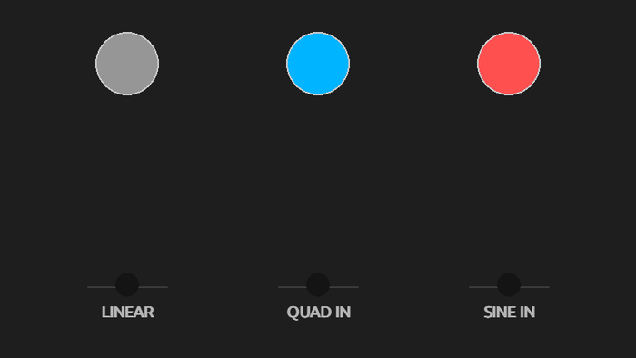

# transytion (beta)

`transytion` is a utility library for easily creating and managinig tweens in game engines like Pygame. It is heavily inspired by [Flux](https://github.com/rxi/flux) and [HUMP.timer](https://hump.readthedocs.io/en/latest/timer.html) from the [Love2d](https://www.love2d.org/) community.

## What is a tween?

A tween takes a variable and gradually changes it from one value to another as time progresses. A player may move from one point to another over a time period for instance. Thus, at the heart of it, a tween must:

- Take a certain `duration` over which to change a variable.
- Take one or more variables to change (called the `targets`)
- Take values to gradually change them too.
- A function that describes the gradual change.

Furthermore, it is often to have convenient to have a way to indicate to the program that the tween has finished. To do so, you may supply a `callback` function to execute once the tween has finished terminating.

## How do I use it?


This library allows you to make tweens and compose them with other tweens that can be used a variety of cases. For instance, you can move objects, change their color, etc. The library operates on fields of objects. Let us see what that means with an example in [Pygame-ce](https://pyga.me/docs/index.html) (although the example can be adapted to other game libraries).

```python
import transytion as ty
from dataclasses import dataclass
from transytion.ease_funcs import quad
import pygame


pygame.init()
screen = pygame.display.set_mode((1280, 720))
clock = pygame.time.Clock()
running = True
dt = 0

@dataclass
class Ball:
    x: float
    y: float

ball = Ball(screen.get_width() / 2.0, 0.0)

# 1 second qudratic fall to center of screen.
fall = ty.Tween(1.0, # Duration of tween is 1 seconds.
                ball, # What object to mess with.
                {"y" : screen.get_height() / 2}, # Animate what to where.
                ease_func=quad) # How to animate it (defaults to linear)

ty.default_manager.add(fall) # Start the tween.

while running:
    for event in pygame.event.get():
        if event.type == pygame.QUIT:
            running = False

    ty.default_manager.update(dt)
 
    screen.fill((0,0,0))
    pygame.draw.circle(screen, "red", (ball.x, ball.y), 40)

    pygame.display.flip()
    dt = clock.tick(60) / 1000

pygame.quit()
```

This is a modification of the first example presented [here](https://pyga.me/docs/index.html). It is recommended you become familiar with that example, and then continue with this example. If you run the program, a red circle moves down the screen. What is going on?

```python
@dataclass
class Ball:
    x: float
    y: float
```

This is used to keep track of the location of the ball on the screen. Tweens operate on fields of objects, so by making a `Ball` object we may tween the `y` (or `x`) fields.

```python
# 1 second qudratic fall to center of screen.
fall = ty.Tween(1.0, # Duration of tween is 1 seconds.
                ball, # What object to mess with.
                {"y" : screen.get_height() / 2}, # Animate what to where.
                ease_func=quad) # How to animate it (defaults to linear)
```

This constructs our tween. It should be pointed out, by itself, the `Tween` object does not do anything until we tell it to run.

```python
ty.default_manager.add(fall) # Start the tween.
```

Once the tween is added to a `TweenManager` object, (such as `ty.default_manager`) the tween begins execution. You can make as many manager objects as you want, but you need at least one, and it is perfectly reasonable to use just one. That is why `transytion` includes a `default_manager` for ease of use.

Lastly, the `TweenManager` needs the time to update each tween it is managing. This is done by going to your game loop and adding the line

```python
ty.default_manager.update(dt)
```

## Making more complicated tweens with `chain`

If you perform

```python
ty.default_manager.add(t1)
ty.default_manager.add(t2)
```

`ty.default_manager` will run both tweens simultaneously. If we want to run `t1` to execute and then `t2` we may `chain` them together:

```python
t3 = chain([t1, t2])
ty.default_manager.add(t3)
```

Using `chain`, complicated tweens can be made from smaller tweens. See [this](https://github.com/thyrgle/transytion/blob/main/examples/chained_tween.py) for a complete example.

## Decorators: Another Way to Tween

Often when thinking in game development terms, it can be tempting to think of game logic and *then* easing and tweens as an afterwards. Unfortunately, this can result in a lot of code restructuring. Transytion can help prevent major refactoring by utilizing Python decorators.

Consider the following scenario: You want a player to move and then say something. Ignoring animations, one might write:

```py
def say_something():
    print("Hello!")

say_something()
```

But if we follow the example above it is a little awkward to combine this with move:

```py
def say_something():
    print("Hello!")

move = Tween(..., callback=say_something)

...
```

Transytion uses decorators to minimize cognitive load:

```py
move = Tween(...)
@tween_then_call(move)
def say_something():
    print("Hello!")

say_something()

...
```

The `@tween_then_call(tween)` decorator delays function calls to execute after the supplied tween executes. Thus, we can focus on game logic first *then* decorate the logic to incorporate tweens.

A full example of this (that is, with a gameloop) can be found [here.](https://github.com/thyrgle/transytion/blob/main/examples/tween_then_call.py)

# Documentation

Further documentation can be found on [readthedocs.](https://transytion.readthedocs.io/en/latest/)
